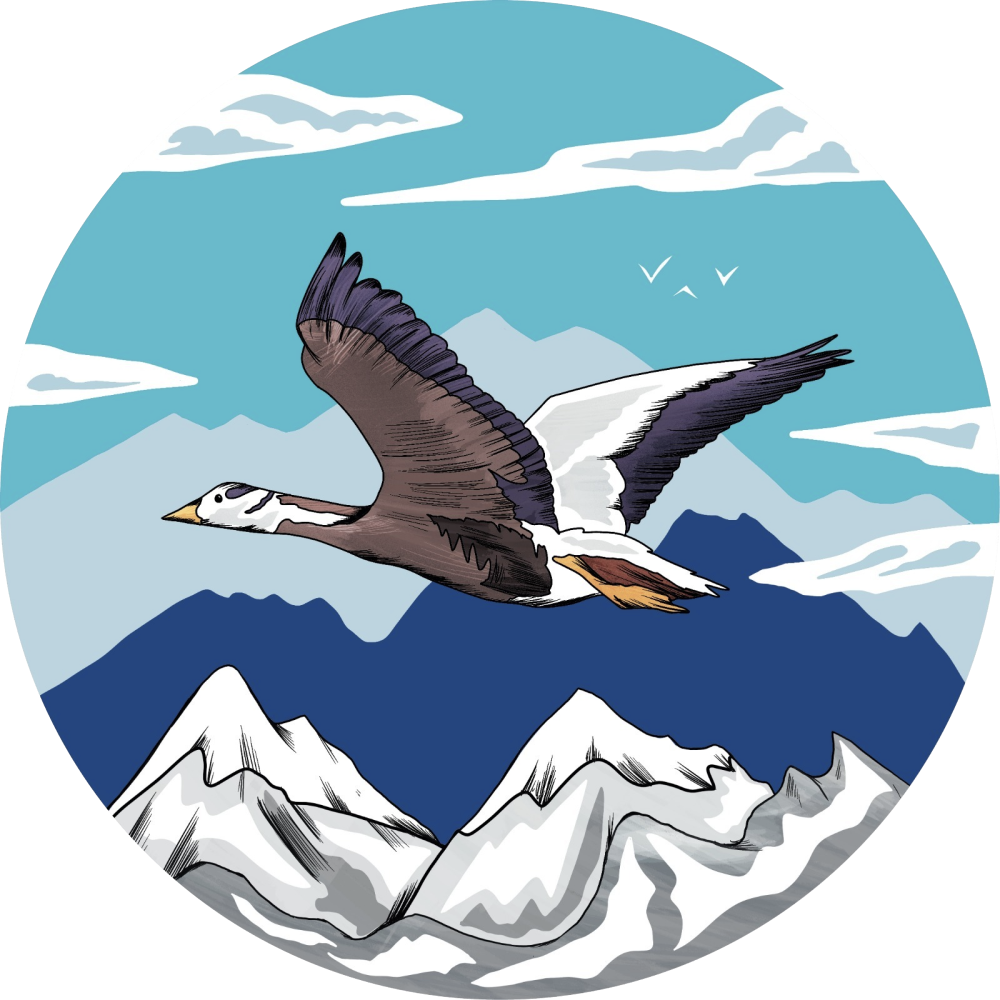
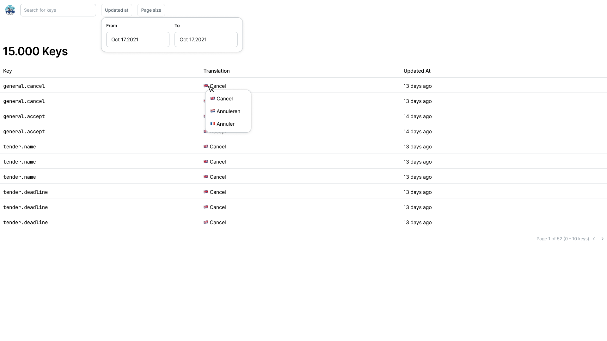

# Hello there, future goose!

This is your technical assessment, in here we expect you to show the best you can do. We expect to see clean code and a good UI with accessibility in mind. We expect that this assessment won't take more than 8 hours.

## What we are looking for

- A good code structure
- Usage of composables
- Code with extensibility in mind
- Use up to date (s)css properties
- Usage of typescript
- Clear documentation (if it helps, add a readme.md)

## The assignment

You are asked to create a overview of all translation keys in Altura. In this view you must be able to filter on `key`, Translation values in different locales and the `updatedAt` date.

### Requirements

- I can see a list of all translation keys
  - I can see the key, translation value and the last updated date
  - When hovering over a row, I see a tooltip with the full translation value for each locale.
- I can filter on keys using a search input
- I can filter on translation keys using a date range
- I can see on which page I am and how many pages there are
  - I am able to change the page
  - I am able to change the page size
- When no keys are found, I see a empty state

The keys are hosted on our directus instance, you can it here:

`https://directus.altura.io/items/translationKeys`

We already took the liberty to write typescript types for you. You can find them in the `types.d.ts` file of this project.

Documentation about filtering in the directus api can be found [here](https://directus.io/docs/guides/connect/filter-rules). One note to add is that you are allowed to use the directus sdk, but bonus points if you don't.

### How it should look

You can use the following design as a reference, but feel free to make it your own.

## Turning the assignment in

You get 3 days to complete this assignment.
We expect you to create a new repository on your own github account. You can use this repository as a template.
When you are done, please send us a link to your repository. We will review your code and get back to you as soon as possible.
If you want to make it private, you should add `roy-ermers` as a collaborator.

---

If you have any questions, feel free to ask! You can find me at:

[roy@altura.io](mailto:roy@altura.io)
[LinkedIn](https://www.linkedin.com/in/roy-ermers-34b414186)
